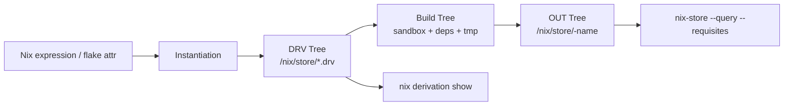

> Deck 01/23 · Intro

# Nix and NixOS Technical Deep Dive

From language semantics to NixOS modules, VM tests, caches, and store introspection.

---

> Deck 02/23 · Map

## Presentation Map

1. Nix language basics
2. `devShell` features
3. Lazy evaluation
4. Nix vs NixOS vs nixpkgs
5. NixOS module system
6. NixOS system configurations and variants
7. NixOS VM tests
8. Substituters
9. Output and derivation introspection

---

> Deck 03/23 · Section 1/9: Nix Language Basics · 1/4

## Literals, Attrsets, and Lists

```nix
{
  board = "stm32f429";
  hz = 168000000;
  debug = true;
  probes = [ "stlink-v2" "jlink" ];
  pins = { led = "PA5"; uart_tx = "PA9"; };
}
```

- Attrsets are the core data structure.
- Lists are ordered and immutable.
- Values are pure expressions.

---

> Deck 04/23 · Section 1/9: Nix Language Basics · 2/4

## `let ... in` and `rec`

```nix
let
  clockHz = 168000000;
in {
  timerTicks = clockHz / 1000;
}
```

```nix
rec {
  pname = "firmware";
  version = "1.2.3";
  imageName = "${pname}-${version}.bin";
}
```

- `let ... in` creates local bindings.
- `rec` enables self-reference inside an attrset.

---

> Deck 05/23 · Section 1/9: Nix Language Basics · 3/4

## Functions and String Interpolation

```nix
{ pkgs, board, optimization ? "s" }:
pkgs.stdenv.mkDerivation {
  pname = "fw-${board}";
  CFLAGS = "-O${optimization}";
}
```

- Functions are first-class and curried.
- Defaults (`?`) make interfaces ergonomic.
- `"${...}"` interpolation composes values safely.

---

> Deck 06/23 · Section 1/9: Nix Language Basics · 4/4

## Numeric Operations and Builtins

```nix
let
  flashKiB = 1024;
  usedKiB = 612;
in {
  freeKiB = flashKiB - usedKiB;
  freePct = (flashKiB - usedKiB) * 100 / flashKiB;
  hasElf = builtins.pathExists ./build/firmware.elf;
}
```

- Arithmetic is straightforward.
- `builtins.*` provides evaluator primitives.
- Keep side effects in derivations, not expressions.

---

> Deck 07/23 · Section 2/9: devShell Features · 1/2

## What `devShell` Solves

- One command (`nix develop`) provisions toolchains, linters, and helpers.
- Team/CI parity improves because all tools are pinned in flake inputs.
- Shell hooks can bootstrap Git hooks, env vars, and guardrails.

```nix
devShells.default = pkgs.mkShell {
  packages = [ pkgs.cmake pkgs.openocd pkgs.gcc-arm-embedded ];
};
```

---

> Deck 08/23 · Section 2/9: devShell Features · 2/2

## Practical `devShell` Patterns

1. Keep shell scope narrow: only dev tools, not runtime closure.
2. Export deterministic vars in `shellHook`.
3. Pair with `direnv`/`nix-direnv` for auto-activation.

```bash
direnv allow
nix develop
```

---

> Deck 09/23 · Section 3/9: Lazy Evaluation · 1/2

## What Laziness Means in Nix

- Expressions are evaluated on demand.
- Unused attributes are not forced.
- This enables large package sets and overlays to remain tractable.

```nix
{
  used = 42;
  expensive = builtins.abort "not forced";
}.used
```

---

> Deck 10/23 · Section 3/9: Lazy Evaluation · 2/2

## Laziness in Day-to-Day Work

- `nix eval` often touches only queried paths.
- Module options are merged lazily until needed.
- Guard expensive logic behind conditionals/options.

```nix
lib.mkIf config.hardware.fpga.enable {
  environment.systemPackages = [ pkgs.yosys pkgs.nextpnr ];
}
```

---

> Deck 11/23 · Section 4/9: Nix vs NixOS vs nixpkgs · 1/2

## Clear Separation of Concerns

- **Nix**: the language + evaluator + store model.
- **nixpkgs**: a giant function set building packages/options.
- **NixOS**: a module system building full systems on top of nixpkgs.

---

> Deck 12/23 · Section 4/9: Nix vs NixOS vs nixpkgs · 2/2

## Mental Model for Embedded Teams

- You can use Nix + nixpkgs without adopting NixOS.
- NixOS adds host/system management and module composition.
- Flakes can expose package outputs and NixOS configs side-by-side.

```nix
outputs = { self, nixpkgs, ... }: {
  packages.x86_64-linux.fw = ...;
  nixosConfigurations.lab-host = ...;
};
```

---

> Deck 13/23 · Section 5/9: NixOS Module System · 1/2

## Module Structure

```nix
{ lib, config, pkgs, ... }:
{
  options.myFeature.enable = lib.mkEnableOption "my feature";

  config = lib.mkIf config.myFeature.enable {
    environment.systemPackages = [ pkgs.htop ];
  };
}
```

- Modules declare options and resulting config.
- Merge semantics are predictable (`mkDefault`, `mkForce`, `mkIf`).

---

> Deck 14/23 · Section 5/9: NixOS Module System · 2/2

## Why Modules Scale

1. Option typing catches misconfiguration early.
2. Composition allows reusable hardware/profile modules.
3. Evaluation yields a single coherent `config`.

Great fit for board families and per-target deltas.

---

> Deck 15/23 · Section 6/9: NixOS Configurations and Variants · 1/2

## `nixosConfigurations.<name>.config`

- `nixosConfigurations.foo.config` is the evaluated system tree.
- You can inspect it with `nix eval`.
- It contains both user-facing options and build artifacts.

```bash
nix eval .#nixosConfigurations.lab.config.networking.hostName
```

---

> Deck 16/23 · Section 6/9: NixOS Configurations and Variants · 2/2

## `config.system.build.*` Variants

`config.system.build` exposes build targets from one evaluated config.

Examples:

- `config.system.build.toplevel`
- `config.system.build.vm`
- `config.system.build.isoImage`
- `config.system.build.sdImage`

```bash
nix build .#nixosConfigurations.lab.config.system.build.vm
```

---

> Deck 17/23 · Section 7/9: NixOS VM Tests · 1/2

## Test Topology as Code

NixOS tests define machine graphs and assertions in one derivation.

```nix
import ./make-test.nix ({ pkgs, ... }: {
  name = "ssh-smoke";
  nodes.machine = { services.openssh.enable = true; };
  testScript = ''machine.wait_for_unit("sshd.service")'';
})
```

---

> Deck 18/23 · Section 7/9: NixOS VM Tests · 2/2

## Why Embedded Teams Should Care

- Validate update paths before touching hardware labs.
- Assert service behavior and artifact wiring in CI.
- Reproduce failures from test derivation hashes.

---

> Deck 19/23 · Section 8/9: Substituters · 1/2

## Binary Caches and Trust

- Substituters avoid rebuilding everything from source.
- Nix verifies content-addressed paths and signatures.
- Configure cache URLs and trusted public keys.

```nix
nix.settings.substituters = [ "https://cache.nixos.org" "https://my-cache.example" ];
nix.settings.trusted-public-keys = [ "my-cache.example:abc123..." ];
```

---

> Deck 20/23 · Section 8/9: Substituters · 2/2

## Embedded Pipeline Strategy

1. Keep a private cache for toolchains and large SDK closures.
2. Pre-build CI outputs and distribute to developers.
3. Use cache metrics to identify cold-start bottlenecks.

---

> Deck 21/23 · Section 9/9: Introspection · 1/3

## Derivations and Store Graph Introspection

```bash
nix derivation show .#slides
nix-store --query --requisites ./result
nix-store --query --referrers /nix/store/<path>
nix-diff /nix/store/<old>.drv /nix/store/<new>.drv
```

- `derivation show`: build recipe-level visibility.
- `--requisites` / `--referrers`: closure graph navigation.
- `nix-diff`: why rebuilds happened.

---

> Deck 22/23 · Section 9/9: Introspection · 2/3

## Instantiation vs Derivations vs Output Paths

Instantiation creates `.drv` nodes. Building realizes output paths in `/nix/store`.



```bash
# instantiate to derivation metadata
nix-instantiate --eval -E '(import <nixpkgs> {}).hello.drvPath'

# build to realize outputs
nix build nixpkgs#hello
```

---

> Deck 23/23 · Section 9/9: Introspection · 3/3

## Live Introspection Slice

<LiveCommandDemo
  title="Nix Introspection Quick Actions"
  description="Run small pre-wired checks to inspect this deck's own pinned environment and closure."
  :actions="[
    { id: 'current-system', label: 'Current system', hint: 'Inspect evaluator host system.' },
    { id: 'slide-tool-versions', label: 'Tool versions', hint: 'Read pinned tool versions from nixpkgs.' },
    { id: 'slide-closure', label: 'Closure size', hint: 'Inspect result closure size.' }
  ]"
/>
